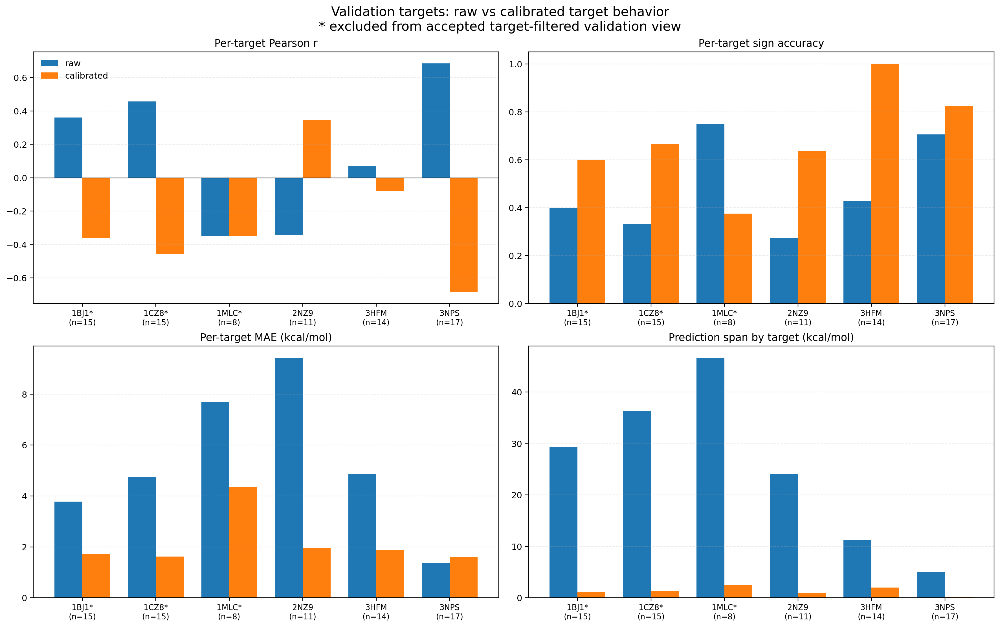
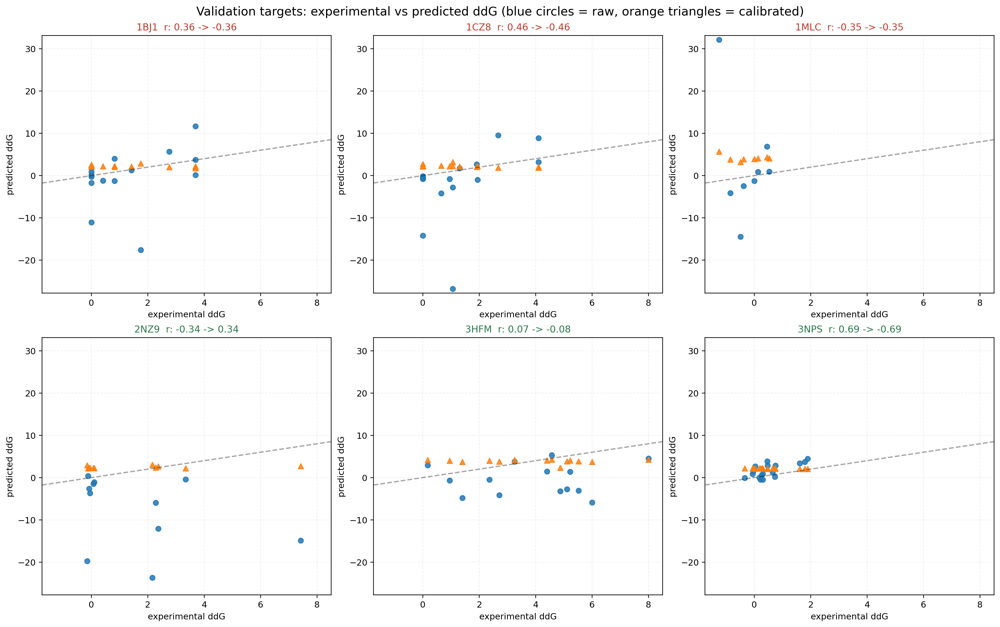
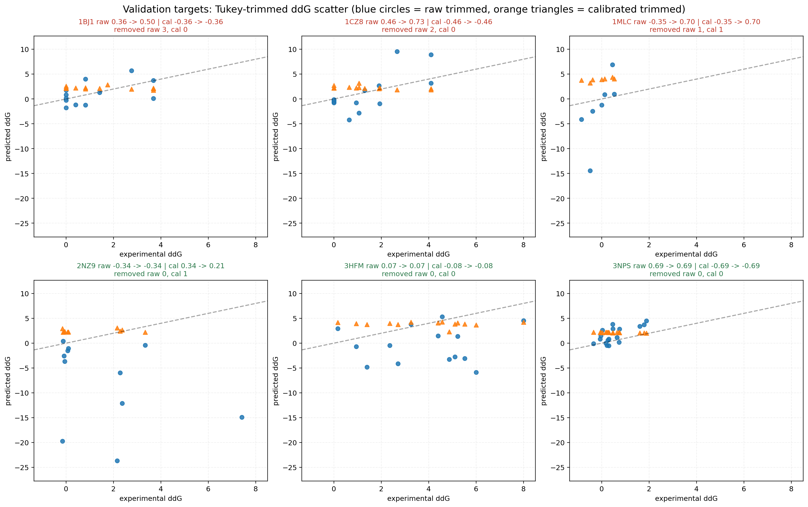
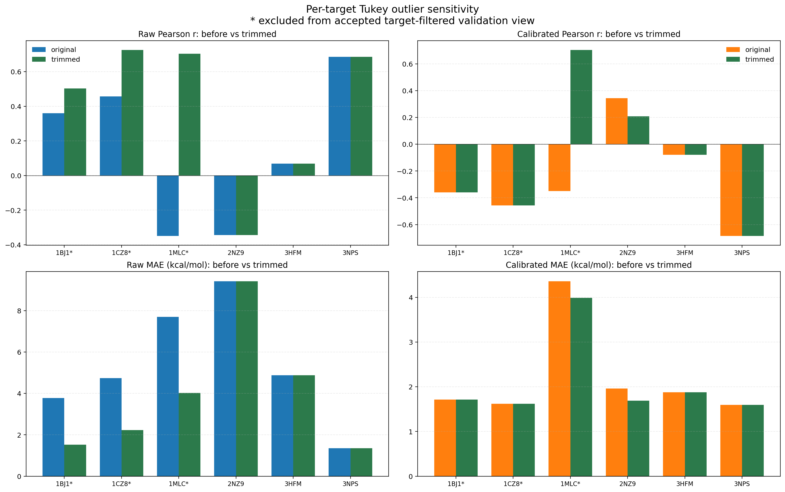

# Validation Target Summary

- Generated at: `2026-06-25T06:40:58.524526+00:00`
- Summary snapshot: `2026-06-23T08:26:32Z`
- Selected model: `side_linear`
- Overall raw Pearson r: `-0.012`
- Overall calibrated Pearson r: `0.200`
- Accepted target-filtered Pearson r: `0.607` on `42` pairs.
- Accepted filtered exclusions: `1MLC, 1CZ8, 1BJ1`
- Raw target-filtered exclusions: `2NZ9, 1MLC, 3HFM`

## Overview Figures

## Target Table

| Target | n | Accepted filtered? | Raw r | Cal r | Raw MAE | Cal MAE | Raw sign | Cal sign | Raw span | Cal span |
|---|---:|---|---:|---:|---:|---:|---:|---:|---:|---:|
| 1BJ1 | 15 | no | 0.36 | -0.36 | 3.78 | 1.71 | 0.40 | 0.60 | 29.27 | 1.08 |
| 1CZ8 | 15 | no | 0.46 | -0.46 | 4.74 | 1.62 | 0.33 | 0.67 | 36.33 | 1.34 |
| 1MLC | 8 | no | -0.35 | -0.35 | 7.69 | 4.36 | 0.75 | 0.38 | 46.58 | 2.47 |
| 2NZ9 | 11 | yes | -0.34 | 0.34 | 9.42 | 1.96 | 0.27 | 0.64 | 24.07 | 0.89 |
| 3HFM | 14 | yes | 0.07 | -0.08 | 4.88 | 1.88 | 0.43 | 1.00 | 11.19 | 1.97 |
| 3NPS | 17 | yes | 0.69 | -0.69 | 1.36 | 1.60 | 0.71 | 0.82 | 4.97 | 0.18 |

## Tukey Outlier Sensitivity

- Per-target outlier trimming uses Tukey fences on absolute error: `abs_error > Q3 + 1.5 * IQR`.
- The trimmed scatter figure below uses the raw and calibrated trimmed sets independently for each target.

| Target | Raw removed | Raw r -> trimmed r | Raw MAE -> trimmed MAE | Cal removed | Cal r -> trimmed r | Cal MAE -> trimmed MAE |
|---|---:|---:|---:|---:|---:|---:|
| 1BJ1 | 3 | 0.36 -> 0.50 | 3.78 -> 1.52 | 0 | -0.36 -> -0.36 | 1.71 -> 1.71 |
| 1CZ8 | 2 | 0.46 -> 0.73 | 4.74 -> 2.23 | 0 | -0.46 -> -0.46 | 1.62 -> 1.62 |
| 1MLC | 1 | -0.35 -> 0.70 | 7.69 -> 4.02 | 1 | -0.35 -> 0.70 | 4.36 -> 3.99 |
| 2NZ9 | 0 | -0.34 -> -0.34 | 9.42 -> 9.42 | 1 | 0.34 -> 0.21 | 1.96 -> 1.69 |
| 3HFM | 0 | 0.07 -> 0.07 | 4.88 -> 4.88 | 0 | -0.08 -> -0.08 | 1.88 -> 1.88 |
| 3NPS | 0 | 0.69 -> 0.69 | 1.36 -> 1.36 | 0 | -0.69 -> -0.69 | 1.60 -> 1.60 |

## Per-target Readout

### 1BJ1

- Readout: Calibration compresses the dynamic range: MAE improves, but target ranking degrades.
- Outlier sensitivity: The calibrated ranking problem persists even after applying a formal outlier screen.
- Acceptance: `no` in the accepted target-filtered view.
- Raw metrics: `r=0.360`, `rho=0.411`, `MAE=3.776`, `sign=0.400`.
- Calibrated metrics: `r=-0.360`, `rho=-0.411`, `MAE=1.712`, `sign=0.600`.
- Prediction span: raw `29.266` kcal/mol, calibrated `1.077` kcal/mol, compression ratio `0.037`.
- Raw Tukey trim: removed `3` pair(s), threshold `7.604` kcal/mol, `r=0.360 -> 0.504`, `MAE=3.776 -> 1.524`.
- Raw removed jobs: `1bj1-antigen-w-g92a, 1bj1-antigen-w-h90a, 1bj1-antigen-w-q89a`.
- Calibrated Tukey trim: removed `0` pair(s), threshold `3.457` kcal/mol, `r=-0.360 -> -0.360`, `MAE=1.712 -> 1.712`.
- Calibrated removed jobs: `none`.

Top raw outliers:

| job_id | predicted | experimental | abs error |
|---|---:|---:|---:|
| 1bj1-antigen-w-q89a | -17.596 | 1.750 | 19.346 |
| 1bj1-antigen-w-h90a | -11.029 | 0.000 | 11.029 |
| 1bj1-antigen-w-g92a | 11.670 | 3.690 | 7.980 |

Top calibrated outliers:

| job_id | predicted | experimental | abs error |
|---|---:|---:|---:|
| 1bj1-antigen-w-h90a | 2.602 | 0.000 | 2.602 |
| 1bj1-antigen-w-h86a | 2.261 | 0.000 | 2.261 |
| 1bj1-antigen-v-f17a | 2.206 | 0.000 | 2.206 |

### 1CZ8

- Readout: Calibration compresses the dynamic range: MAE improves, but target ranking degrades.
- Outlier sensitivity: The calibrated ranking problem persists even after applying a formal outlier screen.
- Acceptance: `no` in the accepted target-filtered view.
- Raw metrics: `r=0.458`, `rho=0.521`, `MAE=4.736`, `sign=0.333`.
- Calibrated metrics: `r=-0.458`, `rho=-0.521`, `MAE=1.620`, `sign=0.667`.
- Prediction span: raw `36.325` kcal/mol, calibrated `1.337` kcal/mol, compression ratio `0.037`.
- Raw Tukey trim: removed `2` pair(s), threshold `11.072` kcal/mol, `r=0.458 -> 0.726`, `MAE=4.736 -> 2.230`.
- Raw removed jobs: `1cz8-antigen-w-h90a, 1cz8-antigen-w-q89a`.
- Calibrated Tukey trim: removed `0` pair(s), threshold `3.977` kcal/mol, `r=-0.458 -> -0.458`, `MAE=1.620 -> 1.620`.
- Calibrated removed jobs: `none`.

Top raw outliers:

| job_id | predicted | experimental | abs error |
|---|---:|---:|---:|
| 1cz8-antigen-w-q89a | -26.765 | 1.060 | 27.825 |
| 1cz8-antigen-w-h90a | -14.218 | 0.000 | 14.218 |
| 1cz8-antigen-w-g88a | 9.561 | 2.670 | 6.891 |

Top calibrated outliers:

| job_id | predicted | experimental | abs error |
|---|---:|---:|---:|
| 1cz8-antigen-w-h90a | 2.720 | 0.000 | 2.720 |
| 1cz8-antigen-w-g92a | 1.869 | 4.100 | 2.231 |
| 1cz8-antigen-w-q87a | 2.225 | 0.000 | 2.225 |

### 1MLC

- Readout: This target is excluded from the accepted target-filtered validation view.
- Outlier sensitivity: Raw target behavior is strongly driven by a small number of extreme outliers.
- Acceptance: `no` in the accepted target-filtered view.
- Raw metrics: `r=-0.349`, `rho=0.286`, `MAE=7.693`, `sign=0.750`.
- Calibrated metrics: `r=-0.349`, `rho=0.286`, `MAE=4.358`, `sign=0.375`.
- Prediction span: raw `46.584` kcal/mol, calibrated `2.472` kcal/mol, compression ratio `0.053`.
- Raw Tukey trim: removed `1` pair(s), threshold `19.097` kcal/mol, `r=-0.349 -> 0.704`, `MAE=7.693 -> 4.024`.
- Raw removed jobs: `1mlc-antibody-l-n92a`.
- Calibrated Tukey trim: removed `1` pair(s), threshold `5.064` kcal/mol, `r=-0.349 -> 0.704`, `MAE=4.358 -> 3.987`.
- Calibrated removed jobs: `1mlc-antibody-l-n92a`.

Top raw outliers:

| job_id | predicted | experimental | abs error |
|---|---:|---:|---:|
| 1mlc-antibody-l-n92a | 32.132 | -1.250 | 33.382 |
| 1mlc-antibody-h-s57v | -14.452 | -0.490 | 13.962 |
| 1mlc-antibody-h-t31a | 6.875 | 0.450 | 6.425 |

Top calibrated outliers:

| job_id | predicted | experimental | abs error |
|---|---:|---:|---:|
| 1mlc-antibody-l-n92a | 5.707 | -1.250 | 6.957 |
| 1mlc-antibody-l-n32g | 3.785 | -0.850 | 4.635 |
| 1mlc-antibody-h-s57a | 3.871 | -0.380 | 4.251 |

### 2NZ9

- Readout: Calibration improves both rank and scale for this target.
- Outlier sensitivity: Outlier trimming changes the scale more than the qualitative conclusion for this target.
- Acceptance: `yes` in the accepted target-filtered view.
- Raw metrics: `r=-0.344`, `rho=-0.155`, `MAE=9.416`, `sign=0.273`.
- Calibrated metrics: `r=0.344`, `rho=0.155`, `MAE=1.960`, `sign=0.636`.
- Prediction span: raw `24.075` kcal/mol, calibrated `0.886` kcal/mol, compression ratio `0.037`.
- Raw Tukey trim: removed `0` pair(s), threshold `39.520` kcal/mol, `r=-0.344 -> -0.344`, `MAE=9.416 -> 9.416`.
- Raw removed jobs: `none`.
- Calibrated Tukey trim: removed `1` pair(s), threshold `4.415` kcal/mol, `r=0.344 -> 0.208`, `MAE=1.960 -> 1.689`.
- Calibrated removed jobs: `2nz9-antigen-a-h1064a`.

Top raw outliers:

| job_id | predicted | experimental | abs error |
|---|---:|---:|---:|
| 2nz9-antigen-a-n918a | -23.666 | 2.160 | 25.826 |
| 2nz9-antigen-a-h1064a | -14.904 | 7.420 | 22.324 |
| 2nz9-antigen-a-n954a | -19.727 | -0.150 | 19.577 |

Top calibrated outliers:

| job_id | predicted | experimental | abs error |
|---|---:|---:|---:|
| 2nz9-antigen-a-h1064a | 2.745 | 7.420 | 4.675 |
| 2nz9-antigen-a-n954a | 2.922 | -0.150 | 3.072 |
| 2nz9-antigen-a-f917a | 2.332 | -0.050 | 2.382 |

### 3HFM

- Readout: This target remains in the accepted filtered view, but the per-target response is still mixed.
- Outlier sensitivity: The calibrated ranking problem persists even after applying a formal outlier screen.
- Acceptance: `yes` in the accepted target-filtered view.
- Raw metrics: `r=0.069`, `rho=-0.024`, `MAE=4.877`, `sign=0.429`.
- Calibrated metrics: `r=-0.079`, `rho=-0.051`, `MAE=1.879`, `sign=1.000`.
- Prediction span: raw `11.187` kcal/mol, calibrated `1.968` kcal/mol, compression ratio `0.176`.
- External 3HFM reference: status `insufficient_pairs`, paired `0`, incomplete `8`.
- Raw Tukey trim: removed `0` pair(s), threshold `14.827` kcal/mol, `r=0.069 -> 0.069`, `MAE=4.877 -> 4.877`.
- Raw removed jobs: `none`.
- Calibrated Tukey trim: removed `0` pair(s), threshold `4.620` kcal/mol, `r=-0.079 -> -0.079`, `MAE=1.879 -> 1.879`.
- Calibrated removed jobs: `none`.

Top raw outliers:

| job_id | predicted | experimental | abs error |
|---|---:|---:|---:|
| 3hfm-antibody-h-y33a | -5.869 | 6.000 | 11.869 |
| 3hfm-antibody-h-c95a | -3.086 | 5.520 | 8.606 |
| 3hfm-antigen-y-y20a | -3.234 | 4.870 | 8.104 |

Top calibrated outliers:

| job_id | predicted | experimental | abs error |
|---|---:|---:|---:|
| 3hfm-antibody-h-s31a | 4.158 | 0.170 | 3.988 |
| 3hfm-antibody-h-y50a | 4.243 | 8.000 | 3.757 |
| 3hfm-antibody-l-q53a | 3.965 | 0.950 | 3.015 |

### 3NPS

- Readout: Calibration flips the target ranking even though the raw target already looked learnable.
- Outlier sensitivity: The calibrated ranking problem persists even after applying a formal outlier screen.
- Acceptance: `yes` in the accepted target-filtered view.
- Raw metrics: `r=0.686`, `rho=0.607`, `MAE=1.355`, `sign=0.706`.
- Calibrated metrics: `r=-0.686`, `rho=-0.607`, `MAE=1.595`, `sign=0.824`.
- Prediction span: raw `4.969` kcal/mol, calibrated `0.183` kcal/mol, compression ratio `0.037`.
- Raw Tukey trim: removed `0` pair(s), threshold `4.409` kcal/mol, `r=0.686 -> 0.686`, `MAE=1.355 -> 1.355`.
- Raw removed jobs: `none`.
- Calibrated Tukey trim: removed `0` pair(s), threshold `2.851` kcal/mol, `r=-0.686 -> -0.686`, `MAE=1.595 -> 1.595`.
- Calibrated removed jobs: `none`.

Top raw outliers:

| job_id | predicted | experimental | abs error |
|---|---:|---:|---:|
| 3nps-antigen-a-y52a | 3.829 | 0.460 | 3.369 |
| 3nps-antigen-a-q23a | 2.633 | 0.030 | 2.603 |
| 3nps-antigen-a-h138a | 4.477 | 1.890 | 2.587 |

Top calibrated outliers:

| job_id | predicted | experimental | abs error |
|---|---:|---:|---:|
| 3nps-antigen-a-i45a | 2.199 | -0.340 | 2.539 |
| 3nps-antigen-a-q168a | 2.166 | -0.060 | 2.226 |
| 3nps-antigen-a-q218a | 2.142 | -0.040 | 2.182 |
